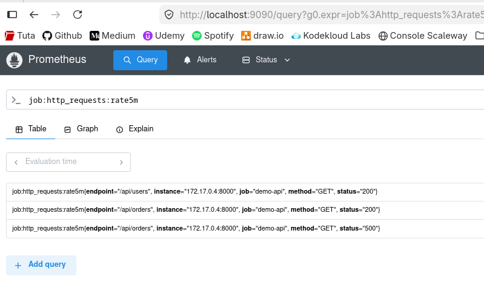

# Module 1 - Prometheus

## Exercice 1 : Installer Prometheus et accéder à l'interface web
Objectif : lancer un seul conteneur Prometheus, accéder à l'interface web sur le port 9090 et vérifier que Prometheus se scrape lui-même.

### Lancer Prometheus
```shell
docker run -d --name prometheus -p 9090:9090 prom/prometheus:latest
```
&nbsp;
### Vérifier si la cible est UP
Ouvrir dans un navigateur http://localhost:9090


Chercher le répertoire de storage (/etc/prometheus/prometheus.yml)
Vérification des logs
```shell
docker logs prometheus
```

Extrait des logs :
```shell
time=2026-04-27T08:49:34.326Z level=INFO source=main.go:1502 msg="Loading configuration file" filename=/etc/prometheus/prometheus.yml
```
&nbsp;

### Lecture du fichier prometheus.yml
```shell
docker exec -it prometheus cat /etc/prometheus/prometheus.yml
```
```yaml
# my global config
global:
  scrape_interval: 15s # Set the scrape interval to every 15 seconds. Default is every 1 minute.
  evaluation_interval: 15s # Evaluate rules every 15 seconds. The default is every 1 minute.
  # scrape_timeout is set to the global default (10s).

# Alertmanager configuration
alerting:
  alertmanagers:
    - static_configs:
        - targets:
          # - alertmanager:9093

# Load rules once and periodically evaluate them according to the global 'evaluation_interval'.
rule_files:
  # - "first_rules.yml"
  # - "second_rules.yml"

# A scrape configuration containing exactly one endpoint to scrape:
# Here it's Prometheus itself.
scrape_configs:
  # The job name is added as a label `job=<job_name>` to any timeseries scraped from this config.
  - job_name: "prometheus"

    # metrics_path defaults to '/metrics'
    # scheme defaults to 'http'.

    static_configs:
      - targets: ["localhost:9090"]
       # The label name is added as a label `label_name=<label_value>` to any timeseries scraped from this config.
        labels:
          app: "prometheus"
```

---

## Exercice 2 : Écrire votre premier prometheus.yml
Objectif : Remplacer la configuration par défaut par votre propre prometheus.yml. Définir un intervalle de scrape global de 10s, un external label environment=lab, et recharger Prometheus sans le redémarrer.

### Supprimer le container
```shell
 docker rm -f prometheus
```


### Créer le fichier avec les paramètres demandés
```yaml
global:
  scrape_interval: 10s
  external_labels:
    environment: lab

scrape_configs:
  - job_name: "prometheus"
    static_configs:
      - targets: ["localhost:9090"]
```

### Lancer le container
```shell
docker run -d \
  --name prometheus \
  -p 9090:9090 \
  -v /home/thomas/Git/tp_observabilite/module_1/exercice_02/prometheus.yml:/etc/prometheus/prometheus.yml \
  prom/prometheus \
  --config.file=/etc/prometheus/prometheus.yml \
  --web.enable-lifecycle
```

### Reload de la conf
```shell
curl -X POST http://localhost:9090/-/reload
```

### Vérification de la configuration sur l'IHM Prometheus
**Status > Configuration**
```
global:
  scrape_interval: 10s
  scrape_timeout: 10s
  scrape_protocols:
  - OpenMetricsText1.0.0
  - OpenMetricsText0.0.1
  - PrometheusText1.0.0
  - PrometheusText0.0.4
  evaluation_interval: 1m
  external_labels:
    environment: lab
  metric_name_validation_scheme: utf8
runtime:
  gogc: 75
scrape_configs:
- job_name: prometheus
  honor_timestamps: true
  track_timestamps_staleness: false
  scrape_interval: 10s
  scrape_timeout: 10s
  scrape_protocols:
  - OpenMetricsText1.0.0
  - OpenMetricsText0.0.1
  - PrometheusText1.0.0
  - PrometheusText0.0.4
  always_scrape_classic_histograms: false
  convert_classic_histograms_to_nhcb: false
  metrics_path: /metrics
  scheme: http
  enable_compression: true
  metric_name_validation_scheme: utf8
  metric_name_escaping_scheme: allow-utf-8
  follow_redirects: true
  enable_http2: true
  static_configs:
  - targets:
    - localhost:9090
otlp:
  translation_strategy: UnderscoreEscapingWithSuffixes
```

---
## Exercice 3 : Ajouter node_exporter et scraper les métriques système
Objectif : Lancer node_exporter et configurer Prometheus pour le scraper. Vérifier que la métrique node_cpu_seconds_total apparaît dans l'expression browser.


### Lancer Node Exporter et récupérer l'adresse IP du conteneur
```shell
docker run -d --name node-exporter -p 9100:9100 prom/node-exporter:latest
039fdaf21b0a413d39b8394b50c241f344a4f1c8c42266684c69da185bb91e46

docker inspect -f '{{range .NetworkSettings.Networks}}{{.IPAddress}}{{end}}' node-exporter
172.17.0.3
```
&nbsp;
### Modification du fichier prometheus.yml
```yaml
global:
  scrape_interval: 10s
  external_labels:
    environment: lab

scrape_configs:
  - job_name: "prometheus"
    static_configs:
      - targets: ["localhost:9090"]

# Ajouté pour l'exercice 3
  - job_name: "node" 
    static_configs:
      - targets: ["172.17.0.3:9100"]
```

&nbsp;
### Reload de la conf
```shell
curl -X POST http://localhost:9090/-/reload
```
&nbsp;

### Requête CPU `node_cpu_seconds_total`


---
## Exercice 4 : Découverte de service : par fichier ou Kubernetes
Objectif : Remplacer les static_configs par un mécanisme de découverte. Sous Docker, utiliser la découverte par fichier ; sous Kubernetes, utiliser kubernetes_sd_configs avec un ServiceMonitor ou un bloc de découverte brut.

### Création targets.json
```json
[
  {
    "targets": ["<IP_NODE_EXPORTER>:9100"],
    "labels": {
      "job": "node",
      "source": "file_sd"
    }
  },
  {
    "targets": ["localhost:9090"],
    "labels": {
      "job": "prometheus",
      "source": "file_sd"
    }
  }
]
```

### Création nouvelle version du fichier prometheus.yml
```yaml
global:
  scrape_interval: 10s
  external_labels:
    environment: lab

scrape_configs:
  - job_name: "dynamic-targets"
    file_sd_configs:
      - files:
          - '/etc/prometheus/sd/targets.json'
        refresh_interval: 5s
```

### Arrêt du conteneur
```shell
docker rm -f prometheus
```

### Lancement avec le nouveau montage pour le Service Discovery
```shell
docker run -d \
  --name prometheus \
  -p 9090:9090 \
  -v /home/thomas/Git/tp_observabilite/module_1/exercice_04/prometheus.yml:/etc/prometheus/prometheus.yml \
  -v /home/thomas/Git/tp_observabilite/module_1/exercice_04/targets.json:/etc/prometheus/sd/targets.json \
  prom/prometheus \
  --config.file=/etc/prometheus/prometheus.yml \
  --web.enable-lifecycle
```

### Vérification du status dynamique


### Modification du targets.json
Permet de vérifier la MAJ dynamique
```json
[
  {
    "targets": [],
    "labels": { "job": "node", "note": "cible_desactivee" }
  },
  {
    "targets": ["localhost:9090"],
    "labels": { "job": "prometheus" }
  }
]
```

### Vérification sur l'IHM Prometheus


---
## Exercice 5 : Règles d'enregistrement (recording rules)
Objectif : Pré-calculer une requête coûteuse sous forme de règle d'enregistrement. Créer un fichier de règles qui enregistre job:http_requests:rate5m toutes les 30 secondes.

### Utilisation du container demo-api
```shell
# Se placer dans le bon dossier
pwd
/home/thomas/Git/tp_observabilite/module_1/exercice_05/Python-App/demo-api/app

# Vérifier les fichiers disponibles
ls
app.py  Dockerfile  prometheus.yml  requirements.txt  traffic.sh

# Build du container
❯ docker compose up -d --build
no configuration file provided: not found
❯ docker build -t demo-api:1.0 .
[+] Building 28.8s (11/11) FINISHED
...
=> exporting to image                                                                                                                                  0.1s 
 => => exporting layers                                                                                                                                 0.1s 
 => => writing image sha256:3a90da6dca4a6c41416011e5add480b0c7089674a3144e7025a2535f413fcf0d                                                            0.0s
 => => naming to docker.io/library/demo-api:1.0

# Démarrage du container
 ❯ docker run -d --name demo-api -p 8000:8000 demo-api:1.0
4a0df226781f911da738f48754b3460b90afeaae66095d5b86f06a881d787099

docker inspect -f '{{range .NetworkSettings.Networks}}{{.IPAddress}}{{end}}' demo-api
172.17.0.4
```

### Vérifier que l'app répond
```shell
curl http://localhost:8000/metrics
# HELP python_gc_objects_collected_total Objects collected during gc
# TYPE python_gc_objects_collected_total counter
python_gc_objects_collected_total{generation="0"} 310.0
python_gc_objects_collected_total{generation="1"} 39.0
python_gc_objects_collected_total{generation="2"} 0.0
...
demo_http_requests_in_flight 0.0
# HELP demo_active_users Number of currently active users (simulated)
# TYPE demo_active_users gauge
demo_active_users 151.0
```

### Créer `rules/api_rules.yml`

```yaml
groups:
  - name: api_rules
    interval: 30s
    rules:
      - record: job:http_requests:rate5m
        expr: rate(demo_http_requests_total[5m])
```

### Lancer Prometheus

```shell
docker rm -f prometheus

docker run -d \
  --name prometheus \
  -p 9090:9090 \
  -v /home/thomas/Git/tp_observabilite/module_1/exercice_05/prometheus.yml:/etc/prometheus/prometheus.yml \
  -v /home/thomas/Git/tp_observabilite/module_1/exercice_05/rules:/etc/prometheus/rules \
  prom/prometheus \
  --config.file=/etc/prometheus/prometheus.yml \
  --web.enable-lifecycle

prometheus
8914cbc0c6cd81e4df765642047def0e5bcd6c579871018e829ba1b61f7f0a0a
```

### Interroger la metric `job:http_requests:rate5m`
```shell
❯ chmod +x traffic.sh
❯ ./traffic.sh
Generating traffic against http://localhost:8000 - Ctrl+C to stop
```

