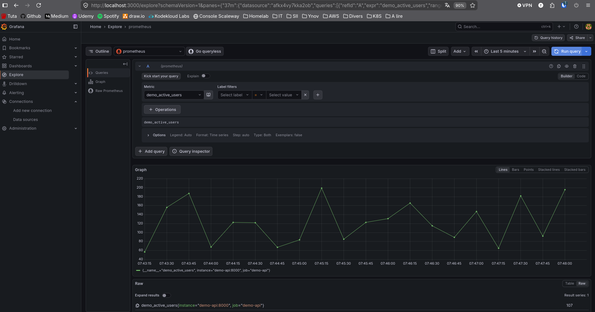
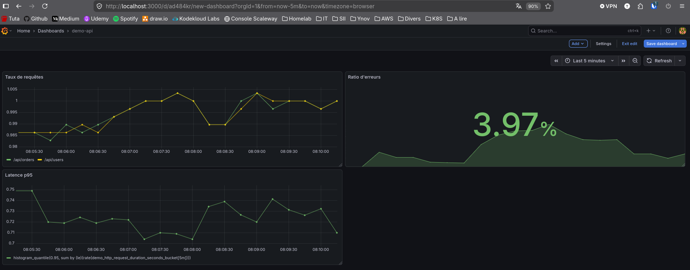
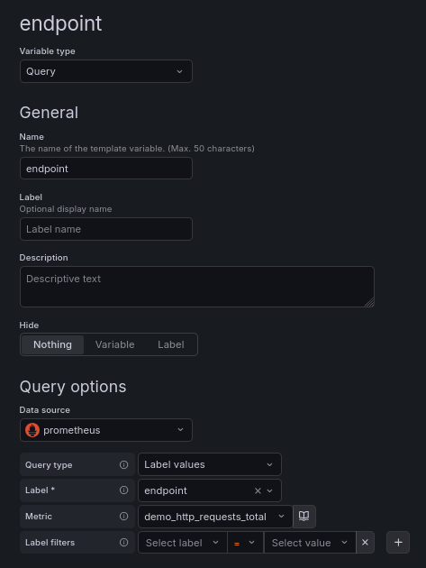
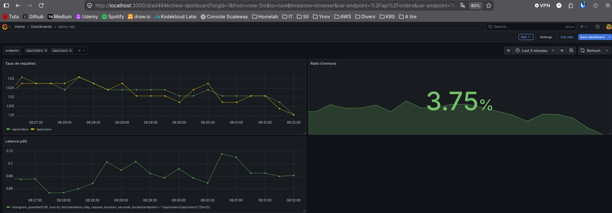
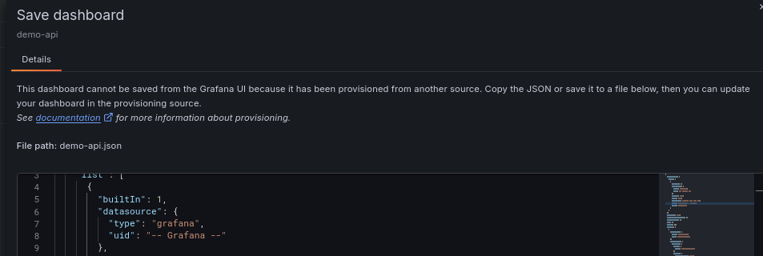
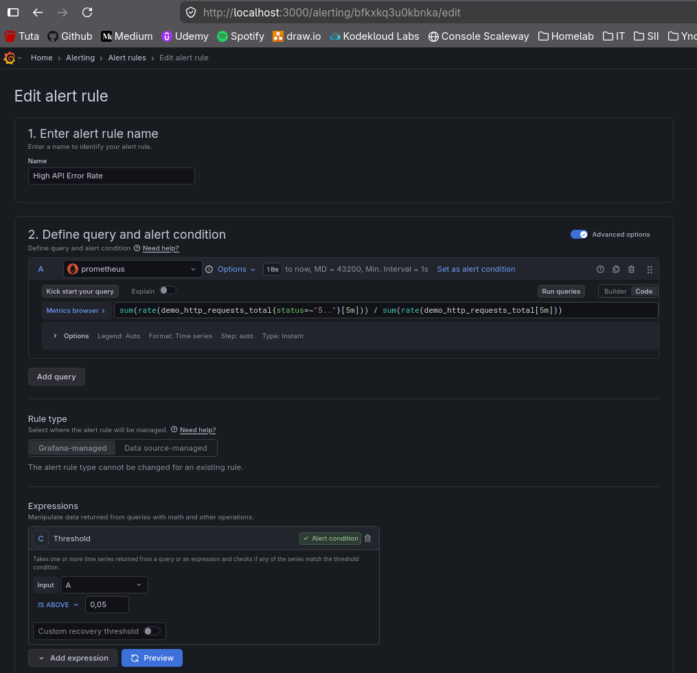
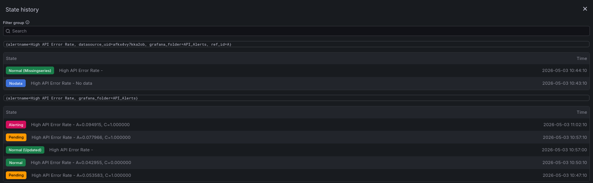

# Module 2 - Grafana

## Exercice 1 : Installer Grafana et se connecter
Objectif : Lancer Grafana et se connecter. Modifier le mot de passe admin par défaut.

### Créer un docker compose Grafana, demo-api, prometheus
```shell
services:
  prometheus:
    image: prom/prometheus:latest
    container_name: prometheus
    ports:
      - "9090:9090"
    volumes:
      - ./prometheus.yml:/etc/prometheus/prometheus.yml
      - prometheus-data:/prometheus
    restart: unless-stopped

  demo-api:
    build: ../Python-App/demo-api/app
    container_name: demo-api
    ports:
      - "8000:8000"
    restart: unless-stopped

  grafana:
    image: grafana/grafana:latest
    container_name: grafana
    ports:
      - "3000:3000"
    volumes:
      - grafana-storage:/var/lib/grafana
      - ./grafana/provisioning/dashboards:/etc/grafana/provisioning/dashboards # Ajouté à l'exercice 5
    depends_on:
      - prometheus
    restart: unless-stopped

volumes:
  prometheus-data:
  grafana-storage:
```

### Lancer la stack
```shell
docker compose -f module_2/docker-compose.yml up -d
```

---
## Exercice 2 : Ajouter Prometheus comme source de données
Objectif : Connecter Grafana à votre Prometheus et confirmer qu'une requête renvoie des données.

- Dans Grafana, aller dans Connections > Data sources > Add data source
- Choisir Prometheus et définir l'URL sur http://prometheus:9090 (les conteneurs doivent partager un réseau Docker)
- Cliquer sur Save & test
- Ouvrir Explore, sélectionner la source Prometheus



---
## Exercice 3  : Construire un dashboard pour demo-api
Objectif : Créer un dashboard avec trois panels : taux de requêtes par endpoint, ratio d'erreurs (single stat), et latence p95 (time series).

**Requêtes utilisées**
- Taux de requêtes: `sum by (endpoint) (rate(demo_http_requests_total[5m]))`
- Ratio d'erreur : `sum(rate(demo_http_requests_total{status=~"5.."}[5m])) / sum(rate(demo_http_requests_total[5m]))`
- Latence p95 : `histogram_quantile(0.95, sum by (le)(rate(demo_http_request_duration_seconds_bucket[5m])))`
&nbsp;

**Création du dashboard demo-api**


---
## Exercice 4 : Variables et templating
Objectif : Ajouter une variable de dashboard nommée $endpoint, peuplée à partir des labels de demo_http_requests_total. Faire en sorte que tous les panels filtrent par cette variable.

**Création de la variable endpoint**

&nbsp;
**Modification des requêtes dans les panels**
- Taux de requêtes: `sum by (endpoint) (rate(demo_http_requests_total{endpoint=~"$endpoint"}[5m]))`
- Ratio d'erreur : `sum(rate(demo_http_requests_total{status=~"5..", endpoint=~"$endpoint"}[5m])) / sum(rate(demo_http_requests_total{endpoint=~"$endpoint"}[5m]))`
- Latence p95 : `histogram_quantile(0.95, sum by (le)(rate(demo_http_request_duration_seconds_bucket{endpoint=~"$endpoint"}[5m])))`

**Dashboard avec sélecteur endpoint**


---
## Exercice 5 : Provisionnement et alertes unifiées
Objectif : Provisionner le dashboard depuis un fichier JSON et créer une règle d'alerte gérée par Grafana qui se déclenche lorsque le ratio d'erreurs dépasse 5 % pendant 5 minutes.
&nbsp;
### Provisioning du dashboard
**Export du dashboard en JSON**
Dashboard > demo-api > Settings > JSON model > copier le bloc texte > coller dans un fichier demo-api.json

**Préparer l'arborescence et les fichiers**
```shell
mkdir -p module_2/grafana/provisioning/dashboards

mv demo-api.json module_2/grafana/provisioning/dashboards/

touch module_2/grafana/provisioning/dashboards/provider.yml
```

```yaml
apiVersion: 1
providers:
  - name: 'default'
    orgId: 1
    folder: ''
    type: file
    disableDeletion: false
    updateIntervalSeconds: 10
    options:
      path: /etc/grafana/provisioning/dashboards
```
&nbsp;
**Modifier le docker compose**
Il faut dire à grafana d'aller lire ces fichiers au démarrage
Modifier le service grafana :
```yaml
grafana:
    image: grafana/grafana:latest
    container_name: grafana
    ports:
      - "3000:3000"
    volumes:
      - grafana-storage:/var/lib/grafana
      # NOUVELLE LIGNE POUR LE PROVISIONING :
      - ./grafana/provisioning/dashboards:/etc/grafana/provisioning/dashboards
    depends_on:
      - prometheus
    restart: unless-stopped
```
&nbsp;
**Redémarrer et vérifier**
```shell
docker compose -f module_2/docker-compose.yml down
docker compose -f module_2/docker-compose.yml up -d
```
&nbsp;
**Vérification du provisionning sur grafana**


&nbsp;
### Alertes unifiées
Dans Grafana, aller dans *Alerting > Alert rules > New alert rule*
- Rule name : `High API Error Rate`
- Query 1 : `Prometheus`
- Requete : `sum(rate(demo_http_requests_total{status=~"5.."}[5m])) / sum(rate(demo_http_requests_total[5m]))`
- Treshold : `IS ABOVE` / `0.05` (qui représente 5%)
- Créer nouveau folder : `API_Alerts`
- Créer nouveau Evaluation group : `1m`
- Pending Period : `5m`
- Enregistrer



Générer du traffic : au bout de quelques minutes, l'aterte passe en **Pending* puis en **Firing**
```shell
./Python-App/demo-api/app/traffic.sh
```
Alerting :


Note : pour arriver au firing, j'ai du modifier ma requête : `sum(rate(demo_http_requests_total{status=~"5..", endpoint="/api/orders"}[5m])) / sum(rate(demo_http_requests_total{endpoint="/api/orders"}[5m]))`