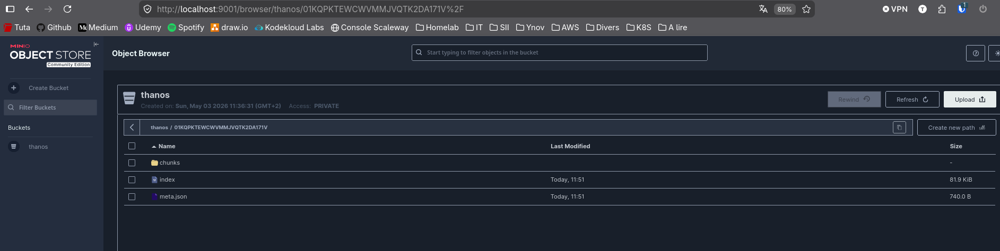
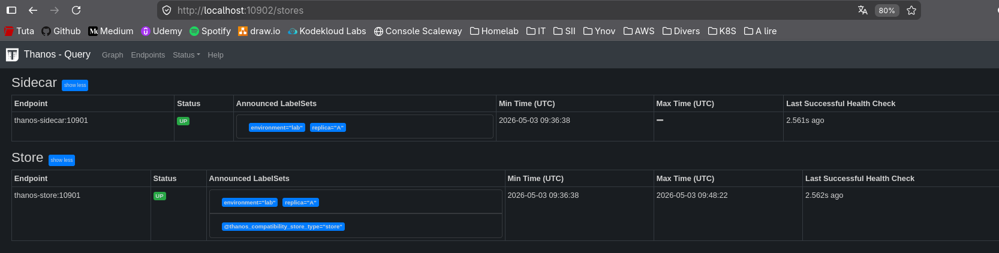
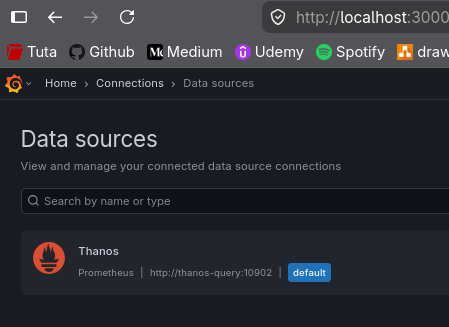
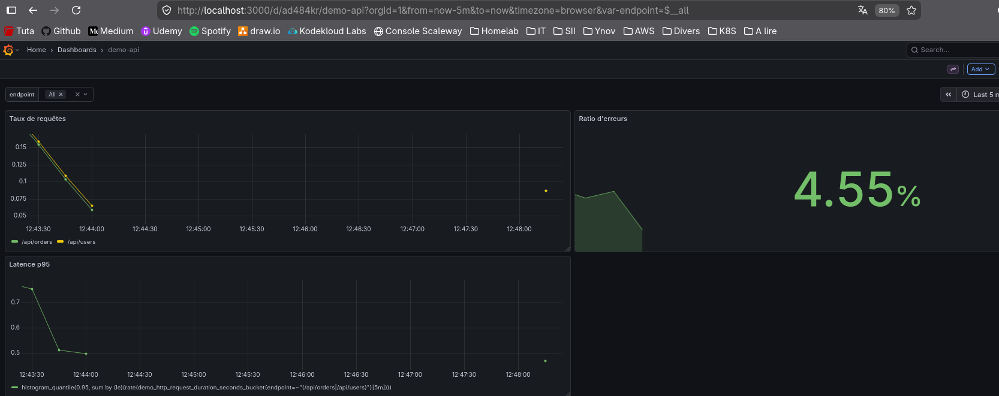
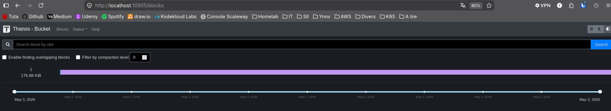

# Module 3 - Thanos (métriques distribuées)

## Exercice 1 : Pourquoi Thanos et le rôle de chaque composant
Objectif : Lire le diagramme d'architecture et répondre :
&nbsp;
**- Quel composant Thanos lit la TSDB locale de Prometheus ?**
C'est le **Thanos Sidecar**, il s'installe à côté de chaque instance Prometheus. Il a 2 objectifs :
    - lire la base de donnée locale (TSDB) pour envoyer les données vers le stockage object
    - permet au Querier de consulter les métrics récentes en temps réel
&nbsp;

**- Lequel reçoit les requêtes de Grafana ?**
C'est le **Thanos Querier**. Il expose la même API HTTP que Prometheus, permettant à Grafana de lui parler sans voir de différences. Il va ensuite chercher les données :
    - soit dans les Sidecars pour le récent
    - soit dans le Store Gateway pour l'historique

&nbsp;
**- Lequel effectue le downsampling dans le stockage objet ?**
C'est le **Thanos Compactor**. Ce composant ne dialogue qu'avec le stockage object (S3, Minio, etc.). Son objectif :
    - compactage : fusionne les petits blocs de données en plus gros pour réduire les coûts d'indexation
    - downsampling : réduit la résolution des vieilles données pour que les graphiques s'affichent instentanément

&nbsp;
**Ressources :**
- https://thanos.io/tip/components/sidecar.md/
- https://thanos.io/tip/components/querier.md
- https://thanos.io/tip/components/store.md
- https://thanos.io/tip/components/compact.md

---
## Exercice 2 : Sidecar + MinIO : envoyer les blocs vers le stockage objet
Objectif : Encapsuler un Prometheus existant avec un sidecar Thanos et vérifier que le premier bloc TSDB est bien envoyé vers MinIO.
&nbsp;
**Créer le dossier thanos et le fichier bucket.yml**
```shell
mkdir module_3/thanos
touch module_3/thanos/bucket.yml
```
```yaml
type: S3
config:
  bucket: thanos
  endpoint: minio:9000
  access_key: admin
  secret_key: password123
  insecure: true # On désactive le HTTPS car on est en local
```
&nbsp;
**Créer un nouveau docker compose**
Ajouter les services Thanos et Minio
```yaml
services:
  prometheus:
    image: prom/prometheus:latest
    container_name: prometheus
    # Thanos a besoin de flags spécifiques pour bloquer le compactage local à 2h
    command:
      - '--config.file=/etc/prometheus/prometheus.yml'
      - '--storage.tsdb.path=/prometheus'
      - '--storage.tsdb.min-block-duration=2h'
      - '--storage.tsdb.max-block-duration=2h'
      - '--web.enable-admin-api'
    ports:
      - "9090:9090"
    volumes:
      - ./prometheus.yml:/etc/prometheus/prometheus.yml
      - prometheus-data:/prometheus
    restart: unless-stopped

  thanos-sidecar:
    image: thanosio/thanos:main-2026-04-30-6e88f93
    container_name: thanos-sidecar
    user: root
    volumes:
      - prometheus-data:/prometheus # On partage le même volume que Prometheus
      - ./thanos/bucket.yml:/etc/thanos/bucket.yml
    command:
      - sidecar
      - --prometheus.url=http://prometheus:9090
      - --tsdb.path=/prometheus
      - --objstore.config-file=/etc/thanos/bucket.yml
    depends_on:
      - prometheus
      - minio

  minio:
    image: minio/minio
    container_name: minio
    ports:
      - "9000:9000" # API S3
      - "9001:9001" # Console Web pour nous
    environment:
      MINIO_ROOT_USER: admin
      MINIO_ROOT_PASSWORD: password123
    volumes:
      - minio-data:/data
    command: server /data --console-address ":9001"

  # Ce service crée automatiquement le bucket 'thanos' au démarrage
  init-minio:
    image: minio/mc
    depends_on:
      - minio
    entrypoint: >
      /bin/sh -c "
      until (/usr/bin/mc alias set myminio http://minio:9000 admin password123) do echo 'Waiting...' && sleep 1; done;
      /usr/bin/mc mb myminio/thanos || true;
      exit 0;
      "

  demo-api:
    build: ../Python-App/demo-api/app
    container_name: demo-api
    ports:
      - "8000:8000"
    restart: unless-stopped

  grafana:
    image: grafana/grafana:latest
    container_name: grafana
    ports:
      - "3000:3000"
    volumes:
      - grafana-storage:/var/lib/grafana
      - ./grafana/provisioning/dashboards:/etc/grafana/provisioning/dashboards
    depends_on:
      - prometheus
    restart: unless-stopped

volumes:
  prometheus-data:
  grafana-storage:
  minio-data:
```
&nbsp;
**Lancer la stack**
```shell
docker compose -f module_3/docker-compose.yml up -d
```

&nbsp;
**Confirmation envoi du bloc**
```shell
docker logs thanos-sidecar -f
ts=2026-05-03T09:42:04.601237419Z caller=options.go:29 level=info protocol=gRPC msg="disabled TLS, key and cert must be set to enable"
ts=2026-05-03T09:42:04.601742108Z caller=factory.go:39 level=info msg="loading bucket configuration"
ts=2026-05-03T09:42:04.602304216Z caller=sidecar.go:444 level=info msg="starting sidecar"
ts=2026-05-03T09:42:04.602618579Z caller=reloader.go:274 level=info component=reloader msg="nothing to be watched"
ts=2026-05-03T09:42:04.602713095Z caller=intrumentation.go:75 level=info msg="changing probe status" status=healthy
ts=2026-05-03T09:42:04.603494252Z caller=http.go:72 level=info service=http/server component=sidecar msg="listening for requests and metrics" address=0.0.0.0:10902
ts=2026-05-03T09:42:04.604027795Z caller=handler.go:87 level=info service=http/server component=sidecar caller=tls_config.go:354 time=2026-05-03T09:42:04.60400308Z msg="Listening on" address=[::]:10902
ts=2026-05-03T09:42:04.604118423Z caller=handler.go:87 level=info service=http/server component=sidecar caller=tls_config.go:357 time=2026-05-03T09:42:04.604099832Z msg="TLS is disabled." http2=false address=[::]:10902
ts=2026-05-03T09:42:04.605355299Z caller=sidecar.go:201 level=info msg="successfully validated prometheus flags"
ts=2026-05-03T09:42:04.605940246Z caller=sidecar.go:224 level=info msg="successfully loaded prometheus version"
ts=2026-05-03T09:42:04.616604005Z caller=sidecar.go:255 level=info msg="successfully loaded prometheus external labels" external_labels="{environment=\"lab\", replica=\"A\"}"
ts=2026-05-03T09:42:04.616643976Z caller=intrumentation.go:56 level=info msg="changing probe status" status=ready
ts=2026-05-03T09:42:04.61680144Z caller=grpc.go:158 level=info service=gRPC/server component=sidecar msg="listening for serving gRPC" address=0.0.0.0:10901
ts=2026-05-03T09:42:06.60397984Z caller=shipper.go:349 level=info msg="no meta file found, creating empty meta data to write later"
ts=2026-05-03T09:51:06.609246854Z caller=shipper.go:474 level=info msg="upload new block" id=01KQPKTEWCWVMMJVQTK2DA171V
```




Note : quelques workaround ont été appliqués pour ce test :
- Accélération du cycle
    - Thanos ne transfère que des blocs "fermés". Prometheus ne ferme un bloc que toutes les 2 heures.
    - Contournement : 
        - Activation de l'API d'administration (`--web.enable-admin-api`) sur Prometheus
        - Déclenchement d'un snapshot manuel via un appel API (`curl -X POST ...`). Cela force Prometheus à créer immédiatement un bloc d'archive à partir des données présentes en mémoire vive.

- Contournement de l'emplacement
    - Le snapshot généré par Prometheus se place dans un sous-dossier `/prometheus/snapshots/`, mais le Sidecar Thanos ne surveille que la racine du dossier `/prometheus/`
    - Contournement : Déplacement manuel du dossier de bloc via une commande `docker exec ... mv`. En déplaçant le bloc à la racine, on "trompe" le Sidecar qui croit alors que Prometheus vient de terminer un cycle normal de 2 heures, ce qui déclenche l'upload immédiat vers MinIO.

---
## Exercice 3 : Store Gateway et Querier : interroger les données historiques
Objectif : Lancer un Thanos Store Gateway pointant sur le bucket et un Querier qui dialogue à la fois avec le sidecar et le store. Confirmer que vous pouvez interroger une plage de temps plus ancienne que la rétention locale de Prometheus.

**Création d'un nouveau docker compose docker-compose-ex3.yml**
Ajout de Store Gateway (pour lire dans MinIO) et Querier (pour piloter l'ensemble)
```yaml
services:
  prometheus:
    image: prom/prometheus:latest
    container_name: prometheus
    # Thanos a besoin de flags spécifiques pour bloquer le compactage local à 2h
    command:
      - '--config.file=/etc/prometheus/prometheus.yml'
      - '--storage.tsdb.path=/prometheus'
      - '--storage.tsdb.min-block-duration=2h'
      - '--storage.tsdb.max-block-duration=2h'
      - '--web.enable-admin-api'
    ports:
      - "9090:9090"
    volumes:
      - ./prometheus.yml:/etc/prometheus/prometheus.yml
      - prometheus-data:/prometheus
    restart: unless-stopped

  thanos-sidecar:
    image: thanosio/thanos:main-2026-04-30-6e88f93
    container_name: thanos-sidecar
    user: root
    volumes:
      - prometheus-data:/prometheus # On partage le même volume que Prometheus
      - ./thanos/bucket.yml:/etc/thanos/bucket.yml
    command:
      - sidecar
      - --prometheus.url=http://prometheus:9090
      - --tsdb.path=/prometheus
      - --objstore.config-file=/etc/thanos/bucket.yml
    depends_on:
      - prometheus
      - minio
  
  thanos-store:
    image: thanosio/thanos:main-2026-04-30-6e88f93
    container_name: thanos-store
    user: root
    volumes:
      - ./thanos/bucket.yml:/etc/thanos/bucket.yml
    command:
      - store
      - --objstore.config-file=/etc/thanos/bucket.yml
      - --data-dir=/var/thanos/store # Cache local pour les index
    depends_on:
      - minio

  thanos-query:
    image: thanosio/thanos:main-2026-04-30-6e88f93
    container_name: thanos-query
    ports:
      - "10902:10902" # Interface Web du Querier
    command:
      - query
      - --http-address=0.0.0.0:10902
      # On pointe vers le Sidecar (données récentes) et le Store (données anciennes)
      - --endpoint=thanos-sidecar:10901
      - --endpoint=thanos-store:10901
      # Déduplication : si on avait plusieurs réplicas, il nettoierait les doublons
      - --query.replica-label=replica 
    depends_on:
      - thanos-sidecar
      - thanos-store  

  minio:
    image: minio/minio
    container_name: minio
    ports:
      - "9000:9000" # API S3
      - "9001:9001" # Console Web pour nous
    environment:
      MINIO_ROOT_USER: admin
      MINIO_ROOT_PASSWORD: password123
    volumes:
      - minio-data:/data
    command: server /data --console-address ":9001"

  # Ce service crée automatiquement le bucket 'thanos' au démarrage
  init-minio:
    image: minio/mc
    depends_on:
      - minio
    entrypoint: >
      /bin/sh -c "
      until (/usr/bin/mc alias set myminio http://minio:9000 admin password123) do echo 'Waiting...' && sleep 1; done;
      /usr/bin/mc mb myminio/thanos || true;
      exit 0;
      "

  demo-api:
    build: ../Python-App/demo-api/app
    container_name: demo-api
    ports:
      - "8000:8000"
    restart: unless-stopped

  grafana:
    image: grafana/grafana:latest
    container_name: grafana
    ports:
      - "3000:3000"
    volumes:
      - grafana-storage:/var/lib/grafana
      - ./grafana/provisioning/dashboards:/etc/grafana/provisioning/dashboards
    depends_on:
      - prometheus
    restart: unless-stopped

volumes:
  prometheus-data:
  grafana-storage:
  minio-data:
```
&nbsp;
**Description des composants**
- **Thanos Store Gateway** : il sert de passerelle. Il ne stocke pas les métriques lui-même, mais il sait comment interroger le bucket MinIO très rapidement pour extraire juste ce dont le Querier a besoin.

- **Thanos Querier** : c'est le point de contact final. Il reçoit la requête de Grafana, la sépare en deux (une pour le Sidecar, une pour le Store Gateway), puis fusionne les résultats pour renvoyer une courbe unique.
&nbsp;
**Lancer la stack**
```shell
docker compose -f module_3/docker-compose-ex3.yml up -d
```
&nbsp;
**Vérification de la fédération des sources dans Thanos Query**


**Nouveau datasource dans Grafana**


**Vérification des metrics dans Grafana**


---
## Exercice 4 : Compactor et downsampling
Objectif : Lancer le Compactor sur le bucket. Observer comment les blocs sont compactés, downsamplés à 5m puis 1h, et comment les blocs anciens diminuent.
&nbsp;
**Création d'un nouveau docker compose docker-compose-ex4.yml**
Ajout de Compactor pour le travail de fond et l'outil Bucket Web pour visualiser l'état des archives.
```yaml
services:
  prometheus:
    image: prom/prometheus:latest
    container_name: prometheus
    # Thanos a besoin de flags spécifiques pour bloquer le compactage local à 2h
    command:
      - '--config.file=/etc/prometheus/prometheus.yml'
      - '--storage.tsdb.path=/prometheus'
      - '--storage.tsdb.min-block-duration=2h'
      - '--storage.tsdb.max-block-duration=2h'
      - '--web.enable-admin-api'
    ports:
      - "9090:9090"
    volumes:
      - ./prometheus.yml:/etc/prometheus/prometheus.yml
      - prometheus-data:/prometheus
    restart: unless-stopped

  thanos-sidecar:
    image: thanosio/thanos:main-2026-04-30-6e88f93
    container_name: thanos-sidecar
    user: root
    volumes:
      - prometheus-data:/prometheus # On partage le même volume que Prometheus
      - ./thanos/bucket.yml:/etc/thanos/bucket.yml
    command:
      - sidecar
      - --prometheus.url=http://prometheus:9090
      - --tsdb.path=/prometheus
      - --objstore.config-file=/etc/thanos/bucket.yml
    depends_on:
      - prometheus
      - minio
  
  thanos-store:
    image: thanosio/thanos:main-2026-04-30-6e88f93
    container_name: thanos-store
    user: root
    volumes:
      - ./thanos/bucket.yml:/etc/thanos/bucket.yml
    command:
      - store
      - --objstore.config-file=/etc/thanos/bucket.yml
      - --data-dir=/var/thanos/store # Cache local pour les index
    depends_on:
      - minio

  thanos-query:
    image: thanosio/thanos:main-2026-04-30-6e88f93
    container_name: thanos-query
    ports:
      - "10902:10902" # Interface Web du Querier
    command:
      - query
      - --http-address=0.0.0.0:10902
      # On pointe vers le Sidecar (données récentes) et le Store (données anciennes)
      - --endpoint=thanos-sidecar:10901
      - --endpoint=thanos-store:10901
      # Déduplication : si on avait plusieurs réplicas, il nettoierait les doublons
      - --query.replica-label=replica 
    depends_on:
      - thanos-sidecar
      - thanos-store  

  thanos-compact:
    image: thanosio/thanos:main-2026-04-30-6e88f93
    container_name: thanos-compact
    user: root
    volumes:
      - ./thanos/bucket.yml:/etc/thanos/bucket.yml
    command:
      - compact
      - --objstore.config-file=/etc/thanos/bucket.yml
      - --data-dir=/tmp/thanos-compact # Dossier de travail local
      - --wait # Reste actif pour scanner le bucket en continu
      # Rétention : on garde le brut 30j, le 5m pendant 6 mois, et le 1h pendant 2 ans
      - --retention.resolution-raw=30d
      - --retention.resolution-5m=180d
      - --retention.resolution-1h=2y
    depends_on:
      - minio

  thanos-bucket-web:
    image: thanosio/thanos:main-2026-04-30-6e88f93
    container_name: thanos-bucket-web
    ports:
      - "10905:10902"
    volumes:
      - ./thanos/bucket.yml:/etc/thanos/bucket.yml  
    command:
      - tools
      - bucket
      - web
      - --objstore.config-file=/etc/thanos/bucket.yml
    depends_on:
      - minio

  minio:
    image: minio/minio
    container_name: minio
    ports:
      - "9000:9000" # API S3
      - "9001:9001" # Console Web pour nous
    environment:
      MINIO_ROOT_USER: admin
      MINIO_ROOT_PASSWORD: password123
    volumes:
      - minio-data:/data
    command: server /data --console-address ":9001"

  # Ce service crée automatiquement le bucket 'thanos' au démarrage
  init-minio:
    image: minio/mc
    depends_on:
      - minio
    entrypoint: >
      /bin/sh -c "
      until (/usr/bin/mc alias set myminio http://minio:9000 admin password123) do echo 'Waiting...' && sleep 1; done;
      /usr/bin/mc mb myminio/thanos || true;
      exit 0;
      "

  demo-api:
    build: ../Python-App/demo-api/app
    container_name: demo-api
    ports:
      - "8000:8000"
    restart: unless-stopped

  grafana:
    image: grafana/grafana:latest
    container_name: grafana
    ports:
      - "3000:3000"
    volumes:
      - grafana-storage:/var/lib/grafana
      - ./grafana/provisioning/dashboards:/etc/grafana/provisioning/dashboards
    depends_on:
      - prometheus
    restart: unless-stopped

volumes:
  prometheus-data:
  grafana-storage:
  minio-data:
```

&nbsp;
**Description des composants**
- **Thanos compact** : gère le cycle de vie des données dans MinIO
- **Thanos bucket web** : pemet d'inspecter l'état du bucket MinIO

&nbsp;
**Lancer la stack**
```shell
docker compose -f module_3/docker-compose-ex4.yml up -d
```
&nbsp;

**Logs thanos-compact**
```
docker logs thanos-compact
ts=2026-05-03T11:07:54.898191183Z caller=factory.go:39 level=info msg="loading bucket configuration"
ts=2026-05-03T11:07:54.898833672Z caller=compact.go:423 level=info msg="retention policy of raw samples is enabled" duration=720h0m0s
ts=2026-05-03T11:07:54.898858934Z caller=compact.go:430 level=info msg="retention policy of 5 min aggregated samples is enabled" duration=4320h0m0s
ts=2026-05-03T11:07:54.898871941Z caller=compact.go:433 level=info msg="retention policy of 1 hour aggregated samples is enabled" duration=17520h0m0s
ts=2026-05-03T11:07:54.899685934Z caller=compact.go:705 level=info msg="starting compact node"
ts=2026-05-03T11:07:54.899710821Z caller=intrumentation.go:56 level=info msg="changing probe status" status=ready
ts=2026-05-03T11:07:54.899924624Z caller=compact.go:1556 level=info msg="start initial sync of metas"
ts=2026-05-03T11:07:54.899949472Z caller=clean.go:67 level=info msg="started cleaning of aborted partial uploads"
ts=2026-05-03T11:07:54.899997257Z caller=clean.go:96 level=info msg="cleaning of aborted partial uploads done"
ts=2026-05-03T11:07:54.899965048Z caller=intrumentation.go:75 level=info msg="changing probe status" status=healthy
ts=2026-05-03T11:07:54.900016152Z caller=http.go:72 level=info service=http/server component=compact msg="listening for requests and metrics" address=0.0.0.0:10902
ts=2026-05-03T11:07:54.900321977Z caller=handler.go:87 level=info service=http/server component=compact caller=tls_config.go:354 time=2026-05-03T11:07:54.900296715Z msg="Listening on" address=[::]:10902
ts=2026-05-03T11:07:54.90034796Z caller=handler.go:87 level=info service=http/server component=compact caller=tls_config.go:357 time=2026-05-03T11:07:54.900342451Z msg="TLS is disabled." http2=false address=[::]:10902
ts=2026-05-03T11:07:54.911298611Z caller=fetcher.go:697 level=info component=block.BaseFetcher msg="successfully synchronized block metadata" duration=11.498569ms duration_ms=11 cached=1 returned=1 partial=0
ts=2026-05-03T11:07:54.913189864Z caller=fetcher.go:697 level=info component=block.BaseFetcher msg="successfully synchronized block metadata" duration=13.294736ms duration_ms=13 cached=1 returned=1 partial=0
ts=2026-05-03T11:07:54.913407067Z caller=blocks_cleaner.go:50 level=info msg="started cleaning of blocks marked for deletion"
ts=2026-05-03T11:07:54.913458086Z caller=blocks_cleaner.go:95 level=info msg="cleaning of blocks marked for deletion done"
ts=2026-05-03T11:07:54.913467597Z caller=compact.go:1570 level=info msg="start of initial garbage collection"
ts=2026-05-03T11:07:54.913535191Z caller=compact.go:1591 level=info msg="start of compactions"
ts=2026-05-03T11:07:54.913549719Z caller=compact.go:1627 level=info msg="compaction iterations done"
ts=2026-05-03T11:07:54.913582416Z caller=fetcher.go:697 level=info component=block.BaseFetcher msg="successfully synchronized block metadata" duration=2.22971ms duration_ms=2 cached=1 returned=1 partial=0
ts=2026-05-03T11:07:54.914003943Z caller=compact.go:457 level=info msg="start first pass of downsampling"
ts=2026-05-03T11:07:54.91909325Z caller=fetcher.go:697 level=info component=block.BaseFetcher msg="successfully synchronized block metadata" duration=5.050412ms duration_ms=5 cached=1 returned=1 partial=0
ts=2026-05-03T11:07:54.919245146Z caller=compact.go:489 level=info msg="start second pass of downsampling"
ts=2026-05-03T11:07:54.922533113Z caller=fetcher.go:697 level=info component=block.BaseFetcher msg="successfully synchronized block metadata" duration=3.210083ms duration_ms=3 cached=1 returned=1 partial=0
ts=2026-05-03T11:07:54.922707662Z caller=compact.go:517 level=info msg="downsampling iterations done"
ts=2026-05-03T11:07:54.927048814Z caller=fetcher.go:697 level=info component=block.BaseFetcher msg="successfully synchronized block metadata" duration=4.293521ms duration_ms=4 cached=1 returned=1 partial=0
ts=2026-05-03T11:07:54.927099242Z caller=retention.go:33 level=info msg="start optional retention"
ts=2026-05-03T11:07:54.927110113Z caller=retention.go:48 level=info msg="optional retention apply done"
ts=2026-05-03T11:07:54.927118729Z caller=clean.go:67 level=info msg="started cleaning of aborted partial uploads"
ts=2026-05-03T11:07:54.92712617Z caller=clean.go:96 level=info msg="cleaning of aborted partial uploads done"
```
&nbsp;
**Bloc TSDB archivé**


---
## Exercice 5 : Vue globale et déduplication HA
Objectif : Lancer deux répliques Prometheus avec les external labels replica=A / replica=B, raccorder les deux sidecars à un seul Querier, puis confirmer la déduplication avec dedup=true dans l'API.

**Création de deux nouveaux fichiers prometheus**

**Création d'un docker compose HA docker-compose-ex5.yml**
```yaml
services:
  # --- CLUSTER A ---
  prometheus-a:
    image: prom/prometheus:latest
    container_name: prometheus-a
    command:
      - '--config.file=/etc/prometheus/prometheus.yml'
      - '--storage.tsdb.path=/prometheus'
      - '--storage.tsdb.min-block-duration=2h'
      - '--storage.tsdb.max-block-duration=2h'
      - '--web.enable-admin-api'
    volumes:
      - ./prometheus-a.yml:/etc/prometheus/prometheus.yml
      - prometheus-a-data:/prometheus

  thanos-sidecar-a:
    image: thanosio/thanos:main-2026-04-30-6e88f93
    container_name: thanos-sidecar-a
    user: root
    volumes:
      - prometheus-a-data:/prometheus
      - ./thanos/bucket.yml:/etc/thanos/bucket.yml
    command:
      - sidecar
      - --prometheus.url=http://prometheus-a:9090
      - --tsdb.path=/prometheus
      - --objstore.config-file=/etc/thanos/bucket.yml
    depends_on:
      - prometheus-a

  # --- CLUSTER B ---
  prometheus-b:
    image: prom/prometheus:latest
    container_name: prometheus-b
    command:
      - '--config.file=/etc/prometheus/prometheus.yml'
      - '--storage.tsdb.path=/prometheus'
      - '--storage.tsdb.min-block-duration=2h'
      - '--storage.tsdb.max-block-duration=2h'
      - '--web.enable-admin-api'
    volumes:
      - ./prometheus-b.yml:/etc/prometheus/prometheus.yml
      - prometheus-b-data:/prometheus

  thanos-sidecar-b:
    image: thanosio/thanos:main-2026-04-30-6e88f93
    container_name: thanos-sidecar-b
    user: root
    volumes:
      - prometheus-b-data:/prometheus
      - ./thanos/bucket.yml:/etc/thanos/bucket.yml
    command:
      - sidecar
      - --prometheus.url=http://prometheus-b:9090
      - --tsdb.path=/prometheus
      - --objstore.config-file=/etc/thanos/bucket.yml
    depends_on:
      - prometheus-b

  # --- LECTURE ET AGGRÉGATION ---
  thanos-query:
    image: thanosio/thanos:main-2026-04-30-6e88f93
    container_name: thanos-query
    ports:
      - "10902:10902"
    command:
      - query
      - --http-address=0.0.0.0:10902
      - --endpoint=thanos-sidecar-a:10901 # Vers Sidecar A
      - --endpoint=thanos-sidecar-b:10901 # Vers Sidecar B
      - --endpoint=thanos-store:10901     # Vers les archives
      - --query.replica-label=replica     # Active la déduplication sur ce label
    depends_on:
      - thanos-sidecar-a
      - thanos-sidecar-b
      - thanos-store

  thanos-store:
    image: thanosio/thanos:main-2026-04-30-6e88f93
    container_name: thanos-store
    user: root
    volumes:
      - ./thanos/bucket.yml:/etc/thanos/bucket.yml
    command:
      - store
      - --objstore.config-file=/etc/thanos/bucket.yml
      - --data-dir=/tmp/thanos/store
    depends_on:
      - minio

  # --- MAINTENANCE ET WEB TOOLS ---
  thanos-compact:
    image: thanosio/thanos:main-2026-04-30-6e88f93
    container_name: thanos-compact
    user: root
    volumes:
      - ./thanos/bucket.yml:/etc/thanos/bucket.yml
    command:
      - compact
      - --objstore.config-file=/etc/thanos/bucket.yml
      - --data-dir=/tmp/thanos-compact
      - --wait
      - --retention.resolution-raw=30d
      - --retention.resolution-5m=180d
      - --retention.resolution-1h=2y
    depends_on:
      - minio

  thanos-bucket-web:
    image: thanosio/thanos:main-2026-04-30-6e88f93
    container_name: thanos-bucket-web
    user: root
    ports:
      - "10905:10902"
    volumes:
      - ./thanos/bucket.yml:/etc/thanos/bucket.yml
    command:
      - tools
      - bucket
      - web
      - --objstore.config-file=/etc/thanos/bucket.yml
      - --http-address=0.0.0.0:10902
    depends_on:
      - minio

  # --- INFRASTRUCTURE (MINIO, API, GRAFANA) ---
  minio:
    image: minio/minio
    container_name: minio
    ports:
      - "9000:9000"
      - "9001:9001"
    environment:
      MINIO_ROOT_USER: admin
      MINIO_ROOT_PASSWORD: password123
    command: server /data --console-address ":9001"
    volumes:
      - minio-data:/data

  init-minio:
    image: minio/mc
    depends_on:
      - minio
    entrypoint: >
      /bin/sh -c "
      until (/usr/bin/mc alias set myminio http://minio:9000 admin password123) do sleep 1; done;
      /usr/bin/mc mb myminio/thanos || true;
      exit 0;
      "

  demo-api:
    build: ../Python-App/demo-api/app
    container_name: demo-api
    ports:
      - "8000:8000"

  grafana:
    image: grafana/grafana:latest
    container_name: grafana
    ports:
      - "3000:3000"
    depends_on:
      - thanos-query
    volumes:
      - grafana-storage:/var/lib/grafana

volumes:
  prometheus-a-data:
  prometheus-b-data:
  minio-data:
  grafana-storage:
```
&nbsp;
**Démarrage de la stack**
```shell
docker compose -f module_3/docker-compose-ex5.yml up -d
```
&nbsp;
**Tests et validation**
*Sans déduplication* : on demande à l'API de nous montrer le résultat brut
```shell
curl 'http://localhost:10902/api/v1/query?query=up&dedup=false'
{"status":"success","data":{"resultType":"vector","result":[{"metric":{"__name__":"up","environment":"lab","instance":"demo-api:8000","job":"demo-api","replica":"A"},"value":[1777807714.327,"1"]},{"metric":{"__name__":"up","environment":"lab","instance":"demo-api:8000","job":"demo-api","replica":"B"},"value":[1777807714.327,"1"]},{"metric":{"__name__":"up","environment":"lab","instance":"localhost:9090","job":"prometheus","replica":"A"},"value":[1777807714.327,"1"]},{"metric":{"__name__":"up","environment":"lab","instance":"localhost:9090","job":"prometheus","replica":"B"},"value":[1777807714.327,"1"]}],"analysis":{}}}%                                                     ❯ 
```
&nbsp;
*Avec déduplication* : on demande à Thanos de nettoyer pour nous afficher qu'une seule entrée.
Le label `replica` a été supprimé par le Querier pour fusionner les données
```shell
curl 'http://localhost:10902/api/v1/query?query=up&dedup=true'
{"status":"success","data":{"resultType":"vector","result":[{"metric":{"__name__":"up","environment":"lab","instance":"demo-api:8000","job":"demo-api"},"value":[1777807719.428,"1"]},{"metric":{"__name__":"up","environment":"lab","instance":"localhost:9090","job":"prometheus"},"value":[1777807719.428,"1"]}],"analysis":{}}}% 
```